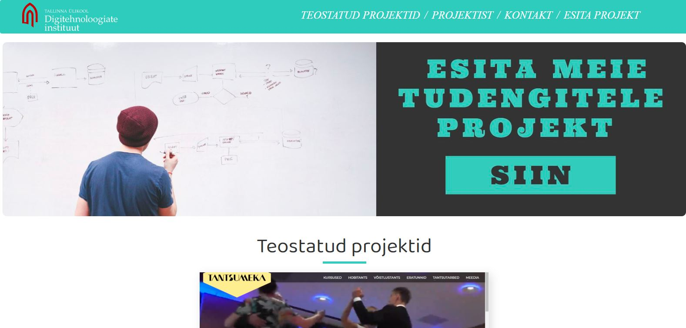

## Veebileht tarkvaraprojektide toetuseks

Veebileht annab võimaluse kõigil inimestel esitada oma projektiideid ning tudengitele neid teostamiseks välja valida. Õppejõule, kes projektide haldamistega tegeleb, on tegu rakendusega, mis projektide valimise oluliselt kergemaks teeb. Projekt toimib ka arhiivina ehk kõik projektid, ka varasematest aastatest, on koos aasta, nimetuse, tegijate, kirjelduse ja kõikvõimalike linkidega lihtsasti kättesaadav. Tudeng saab end vastavasse projekti registreerida, õppejõud seda näha.

https://docs.google.com/presentation/d/1q8f-27p778bQxI4oEl-MwfvJZHJIfuAumwo_S-1VetA/edit#slide=id.g89091075f0_0_75

Projekti koostasid:
1. Mihkel Vaher
2. Kristjan Luur
3. Cornelia Tšaplõgin

----------------------------------------------------------------------------------------------------------------

# SummerProject

Projekt on koostatud Angulari versioon 9.1.6 abil ja kasutatud on Firebase andmebaasi (database), serverit (hosting) ja autentiseerimist (authentication).

## Kasutatud tehnoloogiad

1. Angular versioon 9.1.6
2. Firebase (firebase.google.com)
3. NodeJS 12.18.1

Angulari teegid:
1. @ks89 hammerjs mousetrap - karusell-galerii jaoks
2. animations material cdk - FAQ jaoks
3. @nicky-lenaers g2-sticky-nav - menüü kerimise jaoks

## Kasutamine veebis

Mine veebisaidile summerproject.web.app ja kasuta :)

## Kasutamine lokaalselt

1. Lae alla repositoorium: git clone https://github.com/mihkelva/SummerProject.git
2. Lae alla nodejs: https://nodejs.org/en/
3. Lae alla nodejs teegid: npm install
4. Installi Angular: npm install -g @angular/cli
5. Pane käima lokaalne server käima käsuga: "ng serve" , see peab olema tehtud samas kaustas kus angular.json paikneb (ehk root)
6. Kasuta pordil: localhost:4200

## Projekti uuendamine Firebase serveris

1. Installi Firebase: npm install -g firebase-tools
2. Logi sisse: firebase login
3. Buildi Angulari projekt Firebase jaoks: ng build --prod
4. Deploy projekt Firebase'i: firebase deploy --except functions

## Litsents

<a href="./LICENSE.txt">MIT LICENSE</a>
